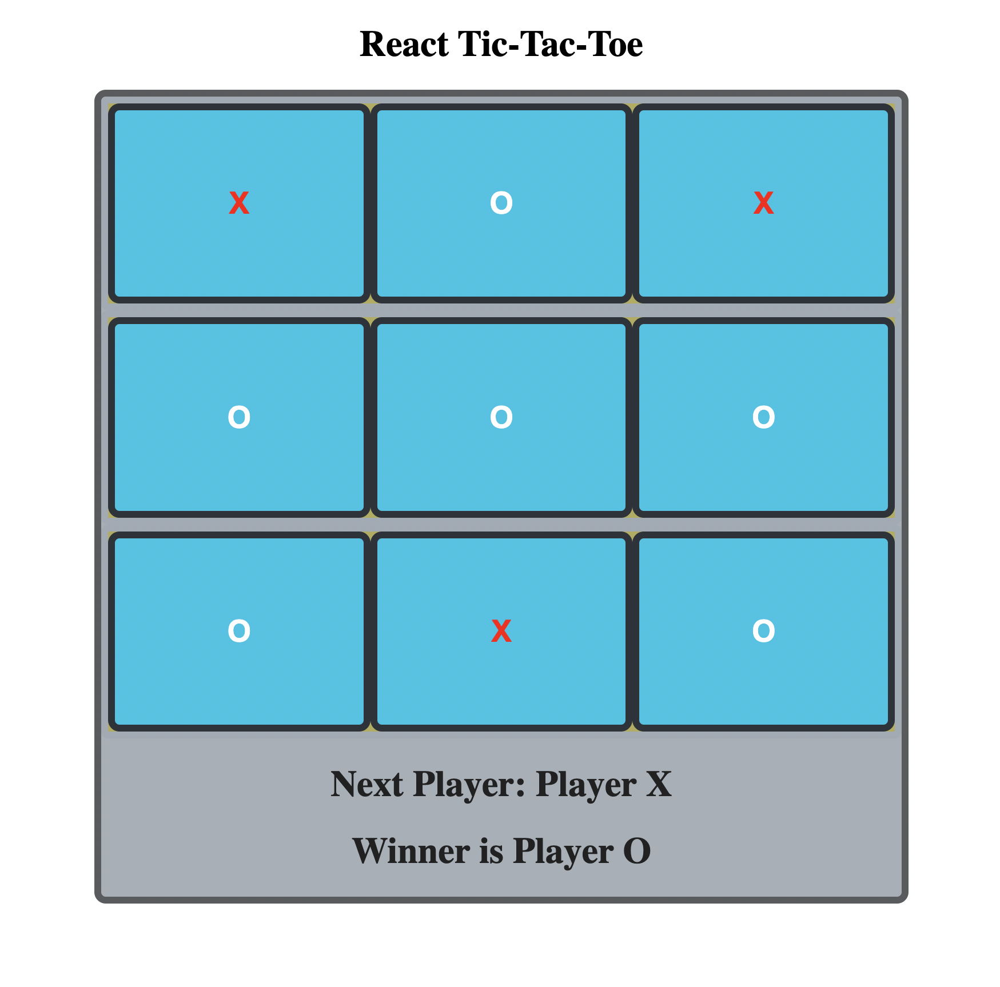

<h1 align="center">Tic-Tac-Toe game using React</h1>

 

 

 
 

*Visit github page for this repository: [Tic-Tac-Toe Game](https://suja-codes.github.io/Tic-Tac-Toe/)*

### Description 

- This React game is based on synchronization of state between parent (board) and child components (squares).

- Synchronization helps the board to keep track of each square in the game. 

- Each square keeps track of whose turn it is (Player X or Player O).

- This will be updated every time a player selects a square.

- The color of the mark is based on the player's turn. "X" - red, and "O" - white.

### To Run this Program

- Fork and Clone the repository on your local machine.

- Drag and drop the index.html file in a browser tab to play the game.

- Start a http server to improve or play around.

### Future RoadMap

This project can be still be enhanced by 

- using icons for each player.

- adding individualized background for each player when a square is clicked based on turns.

  
### License

This exercise stems from MIT xPRO Professional Certificate in Coding: Full Stack Development with MERN Program

> MIT License
> Copyright (c) 2022 Sujatha Arunagiri
> Permission is hereby granted, free of charge, to any person obtaining a copy
> of this software and associated documentation files (the "Software"), to deal
> in the Software without restriction, including without limitation the rights
> to use, copy, modify, merge, publish, distribute, sublicense, and/or sell
> copies of the Software, and to permit persons to whom the Software is
> furnished to do so, subject to the following conditions:
> The above copyright notice and this permission notice shall be included in all
> copies or substantial portions of the Software.
> THE SOFTWARE IS PROVIDED "AS IS", WITHOUT WARRANTY OF ANY KIND, EXPRESS OR
> IMPLIED, INCLUDING BUT NOT LIMITED TO THE WARRANTIES OF MERCHANTABILITY,
> FITNESS FOR A PARTICULAR PURPOSE AND NONINFRINGEMENT. IN NO EVENT SHALL THE
> AUTHORS OR COPYRIGHT HOLDERS BE LIABLE FOR ANY CLAIM, DAMAGES OR OTHER
> LIABILITY, WHETHER IN AN ACTION OF CONTRACT, TORT OR OTHERWISE, ARISING FROM,
> OUT OF OR IN CONNECTION WITH THE SOFTWARE OR THE USE OR OTHER DEALINGS IN THE
> SOFTWARE.
